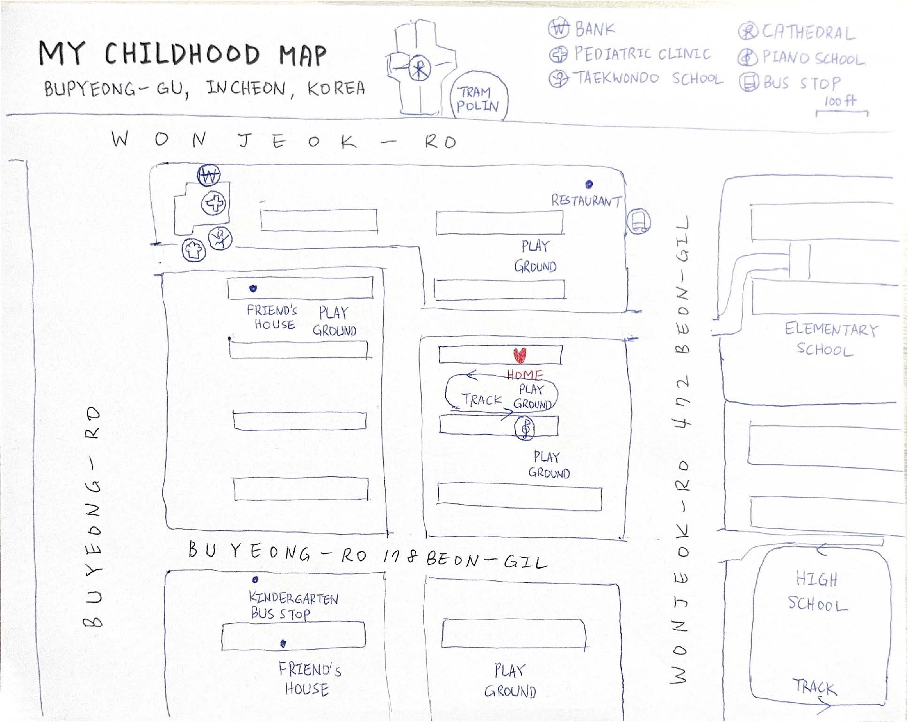

# Introduction

Today's map shows the hand-drawn map of one of the neighborhoods in Bupyeong-gu, Incheon, Korea, which I spent my childhood until the age of 12. I drew the map with a pen and paper and then scanned it. It features the main streets (Wonjeok-ro and Buyeong-ro), my elementary school, my friends' houses, playgrounds, the cathedral etc. The map is not entirely accurate, but it serves as a cherished memory of my childhood.

# Printing and Exporting

